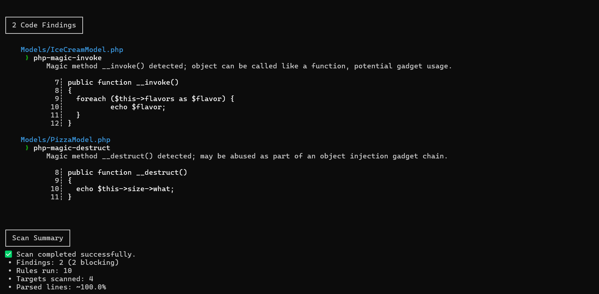

# SemanticGuard: Semgrep Rules for PHP Object Injection (POI) Detection


## Overview


SemanticGuard is a curated collection of Semgrep rules focused on detecting PHP Object Injection (POI) vulnerabilities. This project helps security researchers and DevSecOps engineers integrate automated POI scans into their CI/CD pipelines and code reviews.


## Features


**POI-Focused Rules**: Comprehensive patterns for sinks (`unserialize`, `igbinary_unserialize`, etc.) and magic methods (`__wakeup`, `__destruct`, `__get`, `__invoke`, etc.).

* **Taint Detection**: Rules targeting user-controlled input sources (`$_GET`, `$_POST`, `$_COOKIE`, `php://input`, `session_start()`).

* **Modular Design**: Easily extendable YAML-based rules that you can mix and match for your codebase.


## Getting Started


### Prerequisites


* PHP project (any framework or custom code)

* [Semgrep](https://semgrep.dev/) v1.x or later

* Git and a Unix-like shell (WSL, Linux, macOS)


### Installation


1. Clone this repository:


```bash

  git clone https://github.com/Jaycelation/Scan_Rule.git

  cd POI

```

2. (Optional) Create a Python virtual environment and install Semgrep:


```bash

  python3 -m venv .venv

  source .venv/bin/activate

  pip install semgrep

```

## Usage

### Running the POI Ruleset

Execute the provided rules against your PHP code:


```bash
semgrep --config serializePhp.yml /path/to/your/php/project
```


### Example Output


```bash
(myvenv) jayce@Jayce:/mnt/c/Users/jayce/Downloads/POP Restaurant/challenge$ semgrep --config ../serializePhp.yml Models/
```

